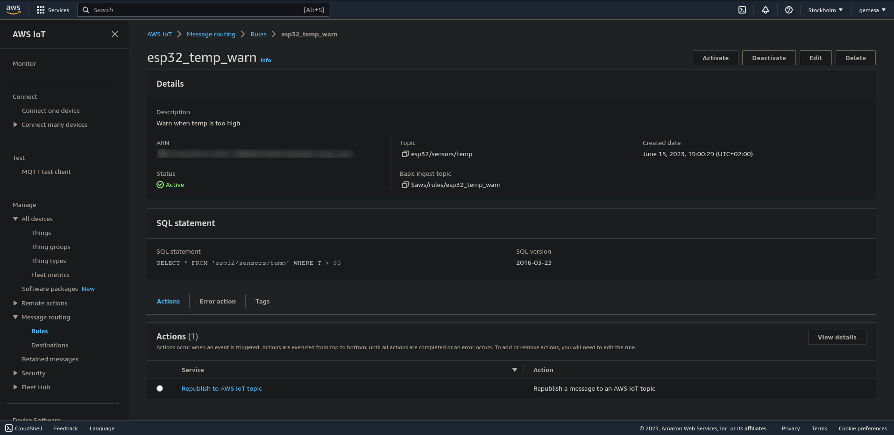
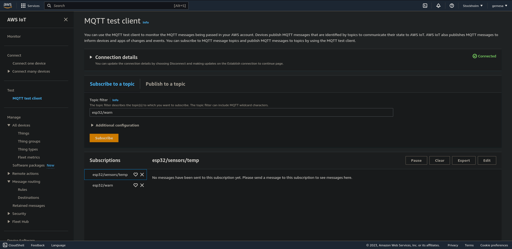
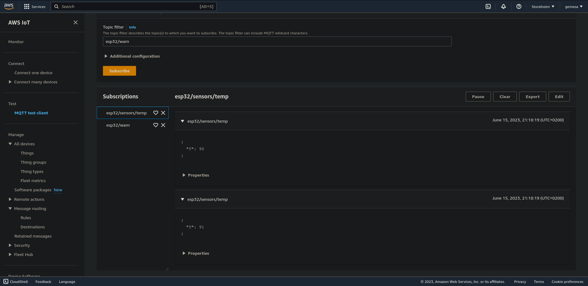
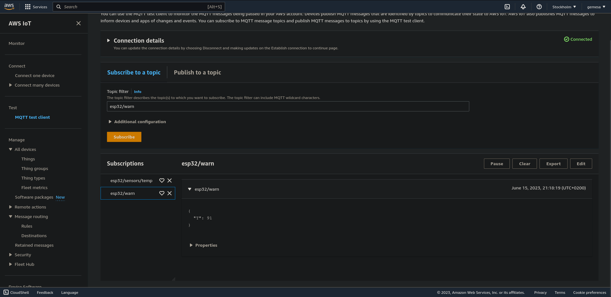

| Supported targets | ESP32 | ESP32-C2 | ESP32-C3 | ESP32-C6 | ESP32-H2 | ESP32-S2 | ESP32-S3 |
| ----------------- | ----- | -------- | -------- | -------- | -------- | -------- | -------- |

# ESP-MQTT SSL sample application (mutual authentication)

This example connects to the AWS IoT broker using ssl transport with client certificate and as a demonstration subscribes/unsubscribes and sends a message on certain topic.

It uses ESP-MQTT library which implements mqtt client to connect to mqtt broker.

## How to use the example

### Hardware required

This example can be executed on any ESP32 board, the only required interface is WiFi and connection to the internet.

### Configure the project

- Open the project configuration menu (`idf.py menuconfig`)
- Configure Wi-Fi under "Example Connection Configuration" menu.
- Add your AWS endpoint to `app_main.c`:
```
static void mqtt_app_start(void)
{
...
    .broker.address.uri = "mqtts://<your-aws-endpoint>:8883",
...
}
```

### Configure AWS IoT

1. Create a simple thing (device) at https://aws.amazon.com/ and download the device certificate, device private key and server (root) certificate.
2. Copy the content of the device certificate to `client.crt`, the content of the device private key to `client.key` and the content of the root certificate to `amazonaws.com.crt`.
3. Add a custom rule which will republish from topic `esp32/sensors/temp` to `esp32/warn` if out temperature value is too high:



4. Subscribe to topic `esp32/sensors/temp` and to topic `esp32/warn`:



### Build and flash

For more information refer to the root [README.md](../README.md).

```
$ idf.py build
$ idf.py flash
```

## Example output

```
$ sudo screen /dev/ttyUSB0 115200
...
I (5646) MQTTS_EXAMPLE: [APP] Free memory: 234868 bytes
I (5656) MQTTS_EXAMPLE: Other event id:7
I (5666) main_task: Returned from app_main()
I (7316) MQTTS_EXAMPLE: MQTT_EVENT_CONNECTED
I (7316) MQTTS_EXAMPLE: sent subscribe successful, msg_id=39078
I (7326) MQTTS_EXAMPLE: sent subscribe successful, msg_id=26176
I (7326) MQTTS_EXAMPLE: sent publish successful, msg_id=0
I (7336) MQTTS_EXAMPLE: sent publish successful, msg_id=0
I (7526) MQTTS_EXAMPLE: MQTT_EVENT_SUBSCRIBED, msg_id=39078
I (8476) MQTTS_EXAMPLE: MQTT_EVENT_DATA
TOPIC=esp32/sensors/temp
DATA={
  "T": 91
}
I (8476) MQTTS_EXAMPLE: MQTT_EVENT_DATA
TOPIC=esp32/sensors/temp
DATA={
  "T": 90
}
I (8516) MQTTS_EXAMPLE: MQTT_EVENT_SUBSCRIBED, msg_id=26176
I (8556) MQTTS_EXAMPLE: MQTT_EVENT_DATA
TOPIC=esp32/warn
DATA={
  "T": 91
}
```




